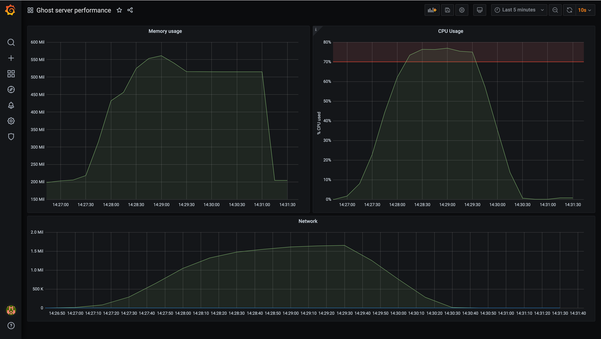

# Performance testing showroom

Project aim's to demonstrate how to monitore a website with tools such as Prometheus, Grafana and Victoria Metrics.

## Services

### Ghost (CMS)

Ghost is a powerful app for new-media creators to publish, share, and grow a business around their content. It comes with modern tools to build a website, publish content, send newsletters & offer paid subscriptions to members.

Please access [the init page](http://localhost/ghost/#/setup) to setup site name and admin account and access backoffice. Frontoffice is available with this [URL](http://localhost)

### Grafana

Grafana is an open-source data visualization and monitoring tool used for creating interactive dashboards and visualizing time series data. It provides a flexible and feature-rich platform for monitoring and analyzing metrics from various data sources such as databases, cloud services, and other systems.

[Grafana frontend](http://localhost:3000) can be accessed with the folowing credentials:

- User : admin
- Password : PassW0rd_

### Victoria Metrics

VictoriaMetrics is an open-source, high-performance, and scalable time series database (TSDB) and monitoring solution. It is designed to store and analyze time series data efficiently, making it suitable for handling large volumes of metrics and logs.

- [Victoria Metrics](http://localhost:8428/vmui)

## How to use

Please note that you need Docker installed to run the stack.
Once installed, please run `make start`.
